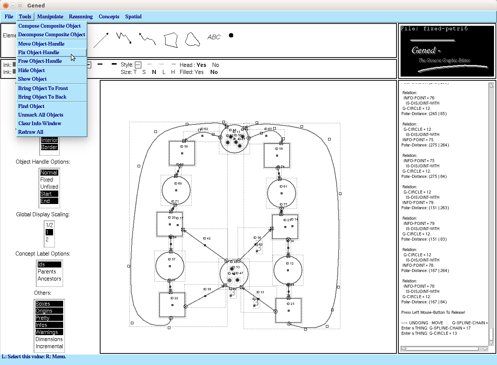

# GenEd  
An Editor with Generic Semantics for Formal Reasoning About Visual Notations, written in Common Lisp & CLIM 

## About

Another piece of Common Lisp & CLIM (Common Lisp Interface Manager)
legacy software from my quarter century-old Lisp archive :-) It still
works flawlessly in 2021. Tested with LispWorks 6.1 & CLIM on Ubuntu, 
32bit Motif port.

The program was written in 1996, as part of [my bachelor thesis
("Studienarbeit")](./studienarbeit.pdf) at Bernd Neumann's Cognitive
System Lab, University of Hamburg, Computer Science Department. The
work was supervised by Volker Haarslev, who had the idea to define the
visual syntax and semantics (of visual formalisms, or formally
specified visual languages) by means of Description Logics.

A key innovative feature was its capability to classify constellations
of graphical objects by taking advantage of the ABox realization /
ABox instance classification service of the CLASSIC Description Logic
system.  The visual syntax of graphical elements and constellations of
such elements could be defined by loading a CLASSIC knowledge base
into the system.  Such a knowledge base would contain definitions for
"visual formalisms", e.g., syntax definitions for Petri Nets, State
Machines, and ER diagrams, with definitions referring to geometric and
topological defining characteristics (e.g., a Transition in a Petri
Net is a Rectangle that is connected to Places, etc.) Topological
spatial relationships played a key role in these definitions.

Originally, Gened was hooked up to the CLASSIC Description Logic
System.  However, I have disabled that part of Gened in this release,
because I am not sure about the status of CLASSIC, I don't have the
sources and don't know where to get them, and I also don't want to
spend the time to get it going again (I might rather hook it up to our
[Racer OWL & Description Logic Rreasoner](https://github.com/ha-mo-we)
at some point). So, the classification capabilities of Gened are not
available / enabled in this release, but you can try hooking it up to
CLASSIC yourself (uncomment the `knowledge` subsystem in the
`gened-sysdcl.lisp` if you can find the CLASSIC sources).

More [details about Gened can found in this
paper](https://www.michael-wessel.info/papers/vl96.pdf), and on [my
homepage](https://www.michael-wessel.info/gened.html).

The original Gened was developed with Allegro Common Lisp CLIM 2,
running on Sun (Classic, IPX and Sun-01) workstations. This pictures
are showing the original version; admittedly, the ACL version of CLIM
looks a bit nicer: 

Today, in 2021, I am able to run this with LispWorks 6.1 on Ubuntu
Xenial, using the Motif32 port of CLIM. It looks not as great as the
original, but is mostly working fine (as long as you don't try to
resize the window:

## Loading / Usage 

Adjust the logical pathname translations in `gened-sysdcl.lisp` to
match your environment. Then, simply do a load, and start the program
with `(gened::gened)`.

Enjoy! Lisp program are written for eternity - 25 years are not that much for 
a Lisp / CLIM program :-) 